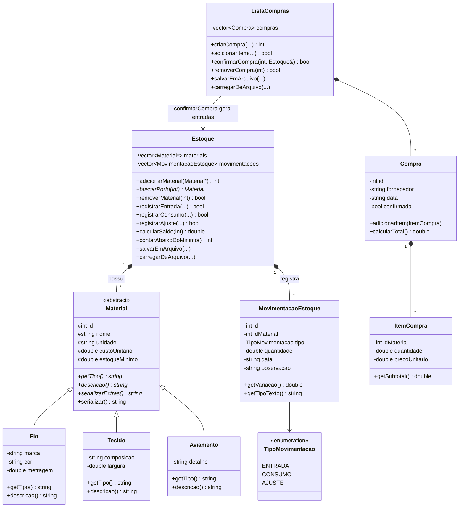

# Módulo Estoque e Compras: diagrama de classes e conceitos de OOP

Arquivos: `Material.h`, `MovimentacaoEstoque.h`, `Estoque.h`, `ListaCompras.h`, `RotasEstoque.h` (em `backend/include/`).

## Diagrama de classes

O GitHub renderiza o bloco abaixo automaticamente. Para exportar como imagem, cole o código em https://mermaid.live.

## Onde cada conceito de OOP aparece (para o relatório e o vídeo)

| Conceito | Onde está no código | Como explicar |
|---|---|---|
| Classes e objetos | `Material`, `Estoque`, `Compra`, `ListaCompras`... | Cada conceito do negócio é uma classe, e cada material ou compra cadastrado é um objeto. |
| Encapsulamento e modificadores de acesso | Atributos `private` em `Fio`, `Compra`... e `protected` em `Material`, com getters e setters | Ninguém altera os dados direto. Os setters validam, por exemplo `std::max(0.0, valor)` impede custo negativo. |
| Herança | `Fio`, `Tecido` e `Aviamento` herdam de `Material` (`Material.h`) | Os dados comuns (nome, unidade, custo, mínimo) ficam na base, e cada tipo acrescenta os seus (marca e cor do fio, largura do tecido). |
| Classe abstrata | `Material` tem métodos virtuais puros (`= 0`): `getTipo`, `descricao`, `serializarExtras` | Não existe "material genérico". Só se cria um fio, um tecido ou um aviamento. |
| Polimorfismo | `Estoque` guarda `vector<Material*>`, e `m->descricao()` e `m->serializar()` chamam a versão de cada tipo | O estoque trata todos como `Material`, mas cada objeto responde do seu jeito, sem `if` por tipo. |
| Destrutor virtual | `virtual ~Material()` | Sem ele, o `delete` por ponteiro da base não destruiria direito o `Fio`, o `Tecido` ou o `Aviamento`. |
| Ponteiros | `Material*` no `Estoque`, que é dono dos objetos e dá `delete` no destrutor | Ponteiro é necessário para o polimorfismo funcionar, porque um `vector<Material>` cortaria o objeto. |
| Referências | `confirmarCompra(int, Estoque&)` e os `const std::string&` nos construtores | Passa o estoque real, sem copiar, para a compra dar entrada nele. |
| Composição | `Estoque` possui materiais e movimentações. `ListaCompras` possui `Compra`, e `Compra` possui `ItemCompra` | O todo controla o ciclo de vida das partes. |
| Enum class | `TipoMovimentacao` (entrada, consumo, ajuste) | Tipos fixos e seguros, no mesmo padrão do `StatusPedido` do time. |
| Cópia bloqueada | `Estoque(const Estoque&) = delete` | O estoque é dono de ponteiros, e copiá-lo geraria dois donos do mesmo objeto. |
| RTTI | `dynamic_cast` em `RotasEstoque.h` | Para enviar ao front os campos próprios de cada tipo (marca do fio, largura do tecido). |

## Regras de negócio para citar

- O saldo nunca é um número editável. Ele é a soma das movimentações (`Estoque::calcularSaldo`).
- Consumo maior que o saldo é recusado, com mensagem explicando o problema.
- Confirmar uma compra gera uma entrada por item e atualiza o custo do material para o preço da compra.
- Compra confirmada e material com movimentações não podem ser excluídos, para preservar o histórico.
